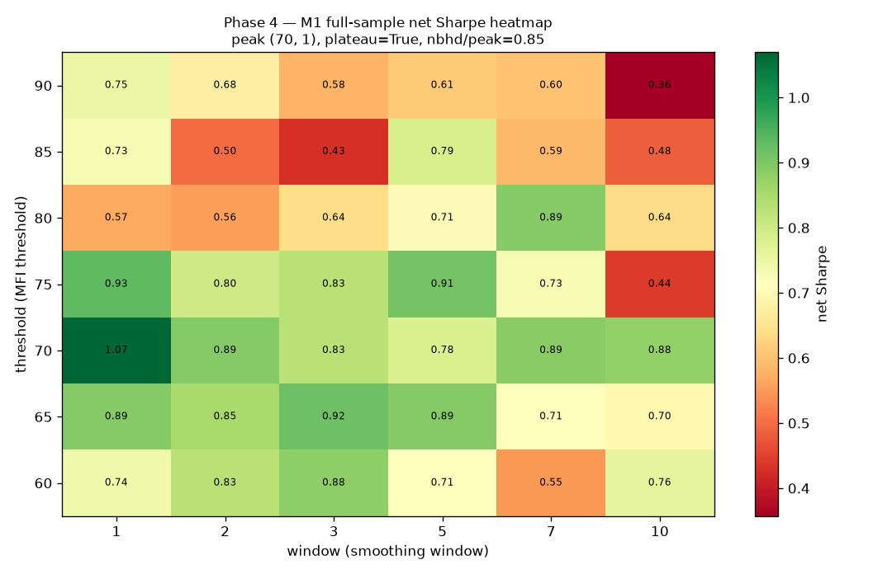
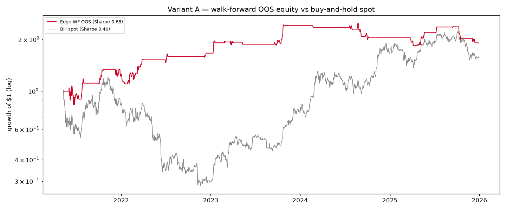
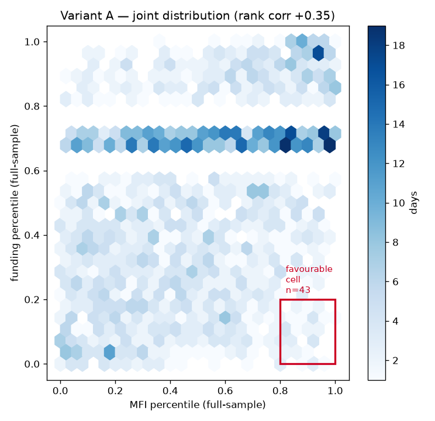
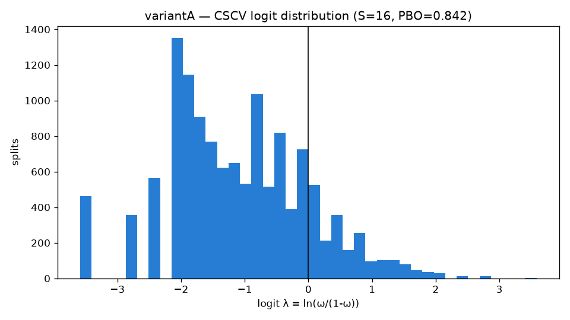

# Spot money-flow signals for BTCUSDT perpetuals — a falsification-first research program

[](https://github.com/AaroNLaU0307/spot-mfi-btc-perp-research/actions/workflows/tests.yml)

Two pre-registered studies test whether a spot Money Flow Index (MFI) signal, alone or combined with
perp funding, predicts Binance USDⓈ-M BTCUSDT perpetual returns. Both were closed honestly: the base
study is `FALSIFIED`, and its follow-up (Variant A) is `INCONCLUSIVE`, weight of evidence leaning
`FALSIFIED`. Nothing here was tuned toward a flattering result — a clean negative is the deliverable.

## Key findings

**Base study — raw spot-MFI momentum: `FALSIFIED`.**
The factor's honest (non-overlapping) Information Coefficient was statistically indistinguishable from
zero (p ≈ 0.30–0.46) before any strategy was built. Optimising anyway: an in-sample parameter plateau
peaked at Sharpe 1.07 (not a spike — 3×3 neighbourhood retained 85% of peak Sharpe), but the embargoed
walk-forward out-of-sample Sharpe collapsed to **0.29**, below buy-and-hold spot (0.46) and below the
pre-registered 0.5 floor. 0 of 42 grid configs survived Benjamini–Hochberg FDR correction. 2 of the 7
pre-registered gates passed (plateau, cost-robustness); the other 5 — including both out-of-sample
significance gates — failed.



*The Sharpe peak (dark green, T=70, W=1) sits inside a broad plateau of similarly-strong neighbours —
not an isolated spike — yet this entire in-sample landscape (peak 1.07) collapsed to a walk-forward
out-of-sample Sharpe of 0.29.*

→ [output/REPORT.md](output/REPORT.md)

**Variant A — spot-MFI vs funding divergence: a fake winner caught in the act.**
This closes the one angle the base study left unadjudicated: does perp funding (a leverage/positioning
signal, not a price-level one) add information the raw MFI lacked? Phase 1 said no before any PnL was
computed — the divergence-favourable state (`MFI` percentile-rank high AND funding percentile-rank low)
occurred on only 2.8% of days, and the resulting Edge signal's honest IC was *weaker* than the raw MFI's.
Optimised anyway, its walk-forward OOS Sharpe (**0.68**) *beat* buy-and-hold (0.46), sat on a genuine
plateau, and passed in-sample DSR (0.96) — the best-looking number in the whole program. It then failed
both out-of-sample significance gates: a stationary block-bootstrap 95% CI on the OOS Sharpe of
**[−0.19, 1.62]** includes zero, and a factor-permutation null gives **p = 0.10**. Per-fold OOS Sharpe was
strongly positive in 2021–23 and negative in 2024–25 — the entire apparent edge was built by sitting flat
through the 2022 crash, not by predicting returns. Verdict: **`INCONCLUSIVE`, leaning `FALSIFIED`**.



*The entire out-of-sample outperformance is built in 2021–23 by sitting flat through the 2022 crash;
from 2024 the strategy stagnates while buy-and-hold spot rallies to close the gap.*

→ [output/REPORT_variantA.md](output/REPORT_variantA.md)

**Structural findings (apply to both studies):**
- The cross-exchange spot MFI proxy is 0.997-correlated with single-Binance MFI — Binance dominates spot
  volume, so "cross-exchange breadth" adds essentially nothing here.
- MFI and daily funding are positively correlated (+0.32 Pearson / +0.35 Spearman): strong spot flow and
  crowded leveraged longs tend to co-occur, which is *why* the favourable divergence cell is so sparse.
- A post-hoc PBO/CSCV check (below) found a high probability of backtest overfitting in both studies'
  parameter selection — base **0.72** (range 0.67–0.72 across S=8/12/16), Variant A **0.84** (range
  0.79–0.94) — additional post-hoc corroboration of both verdicts (same frozen grids and data, not an
  independent dataset).



*High MFI and low funding rarely co-occur — only 43 of the full sample's days fall in the favourable
cell (red box); the two are positively correlated (rank corr +0.35), which is why the
divergence-favourable state is sparse to begin with (the headline 2.8% figure uses a trailing rather
than full-sample rank window, but shows the same pattern).*

## Post-hoc supplementary validation

After both verdicts were frozen, a combinatorial PBO (Probability of Backtest Overfitting, via CSCV —
Bailey, Borwein, López de Prado & Zhu 2017) and the associated CPCV out-of-sample Sharpe distribution
were computed against the same frozen grids, as the deferred "optional, gold standard" check from the
original brief. **This cannot revise either verdict by design** — see the explicit rule and the exact
numbers in the "Post-hoc supplementary validation" section appended to each report
([base](output/REPORT.md), [Variant A](output/REPORT_variantA.md)) and in
[output/phase_B2_pbo.md](output/phase_B2_pbo.md). The implementation ships with two mandatory synthetic
sanity checks (`tests/test_pbo.py`) — a pure-noise return matrix must give PBO ≈ 0.5, a planted dominant
strategy must give PBO near 0 — both of which pass. Every test run, and every test deliberately not run,
is listed with its rationale in [docs/TEST_RATIONALE.md](docs/TEST_RATIONALE.md).



*Most of the 12,870 combinatorial splits fall left of zero — the config picked as best in-sample ranks
below the out-of-sample median 84% of the time (PBO 0.84), corroborating the verdict above without
revising it.*

## Method

0. **Data integrity** — pull cross-exchange spot OHLCV + Binance perp OHLCV/funding; coverage report.
1. **Factor EDA** — Information Coefficient across horizons/transforms, decile forward-return buckets,
   stationarity. No strategy PnL.
2. **Pre-registration** — freeze hypothesis, direction, model, and the numeric decision rule from the
   factor's IC (never from PnL), *before* any optimisation.
3. **Signal + backtest** — minimal signal models; a daily engine with fees, slippage, and actual
   historical funding, factor lagged ≥1 bar, executed at the next bar's open.
4. **Optimisation** — 2D parameter grid, Sharpe heatmap, plateau (anti-spike) test, embargoed (≥14-bar)
   walk-forward. The walk-forward OOS number is the verdict input, not the in-sample peak. (No separate
   "purge" step here — config selection uses trailing in-sample data with no forward-looking labels, so
   the embargo gap is the whole leakage guarantee. The post-hoc CSCV in step 7 *does* purge, since it
   has many combinatorial split boundaries rather than one — see `docs/AUDIT.md`.)
5. **Validation** — Deflated/Probabilistic Sharpe Ratio, BH-FDR across the grid, stationary block
   bootstrap, factor-permutation null.
6. **Report + verdict** — `CONFIRMED EDGE` / `FALSIFIED` / `INCONCLUSIVE`, cost-sensitivity, next steps.
7. **(Post-hoc, both studies)** PBO via CSCV (purged, ≥14-bar) + CPCV OOS-Sharpe distribution, appended
   after the verdict.

Variant A reuses the base study's validated engine, statistics module, and embargoed walk-forward
unchanged (`src/backtest.py`, `src/stats.py`, `src/walkforward.py`) — the only new code for Variant A is
the Edge signal itself (`src/divergence.py`) and its EDA/report scripts. See
[docs/DECISION_LOG.md](docs/DECISION_LOG.md) for every design fork and why each branch was taken.

## Honest scope & limitations

- **The factor is a disclosed proxy, not Glassnode's series.** No Glassnode API key was available, so
  both studies use a self-computed cross-exchange spot MFI (14-day, `typical price × volume`,
  volume-weighted across Binance/Coinbase/Kraken/Bitstamp/OKX via `ccxt`) — a faithful reconstruction of
  what Glassnode aggregates, but not identical to it. Kraken's coverage begins 2024-07-10 (its API only
  serves recent history; earlier days are dropped, never filled). A real key would require re-running
  the whole pipeline on the genuine series and comparing.
- **The sample is bull-regime-heavy.** 2020-05-11 → 2025-12-31 contains one full bear market (2022) and
  otherwise a long uptrend. Conclusions here are regime-scoped, not a universal statement about the
  factor in a bear or range-bound market.
- **Single asset.** Only BTCUSDT perpetual was tested; no cross-sectional or multi-asset evidence.
- **The one real, if non-persistent, effect (drawdown avoidance) is risk management, not alpha.** Variant
  A's entire apparent edge traces to a single crash-avoidance episode (2022) and reversed sign in
  2024–25. It rests on n=1 crash and was deliberately not pursued further as a standalone strategy — see
  each report's "Next steps" for how it would need to be reframed and tested to mean anything.

## Layout

```
config.py          # single source of truth (no magic numbers)
src/                data_spot, data_perp, mfi, eda, signals, divergence, backtest, walkforward,
                     performance, stats, pbo
run_*.py            # phase entry scripts (run_0X = base study, run_AX = Variant A, run_B2 = post-hoc)
tests/              # pytest — MFI, no-lookahead, embargo (walk-forward) + purge (CSCV), DSR, PBO, etc.
data_cache/         # raw pulls + intermediate parquet (gitignored; reproducible from the loaders)
output/             # figures + reports (committed — these are the deliverables)
research/           # PREREGISTRATION*.md (frozen before optimisation)
docs/               # DECISION_LOG.md, TEST_RATIONALE.md, AUDIT.md
```

## Run

Requires **Python 3.12+** (developed and audited on 3.13; CI proved the pinned `numpy==2.5.0` has no
Python 3.11 wheel — see `docs/DECISION_LOG.md`). Dependencies are pinned in
[requirements.txt](requirements.txt); `ccxt` and `requests` are only needed to regenerate `data_cache/`
from public endpoints — no API key is required for the proxy pipeline described above.

macOS / Linux (bash):
```bash
python3 -m venv .venv
source .venv/bin/activate
pip install -r requirements.txt

python run_00_data.py       # Phase 0 — pull cross-exchange data + integrity report (~1-2 min; network)
python run_01_eda.py        # Phase 1 — factor EDA
python run_04_optimize.py   # Phase 4 — grid + embargoed walk-forward
python run_05_validate.py   # Phase 5 — significance battery
python run_06_costs.py      # Phase 6 — cost sensitivity
python run_A1_eda.py        # Variant A phases 1/4/5/6
python run_A4_optimize.py
python run_A5_validate.py
python run_A6_costs.py
python run_B2_pbo.py        # Post-hoc PBO/CSCV + CPCV (both studies; ~1-2 min, no network)
```

Windows (PowerShell):
```powershell
python -m venv .venv
.venv\Scripts\Activate.ps1
pip install -r requirements.txt

python run_00_data.py
python run_01_eda.py
# ... same order as above
```

`run_00_data.py` (and Variant A's funding step inside `run_A1_eda.py`) regenerate `data_cache/` from
public Binance/Coinbase/Kraken/Bitstamp/OKX endpoints — no API key needed, and it takes roughly a
minute or two depending on rate limits. Every later script reads from that cache and has no network
dependency.

## Tests

```bash
python -m pytest -q
```

This suite runs in CI on every push to `main`, every pull request, and on manual dispatch, across
Ubuntu/Windows/macOS × Python 3.12/3.13 (badge above).

59 tests, no network access and no `data_cache/` required (they use small synthetic fixtures throughout)
— runs in a few seconds. Covers: MFI correctness against hand-worked examples, no-lookahead/factor-lag
mechanics, signal truncation-invariance, embargo boundary correctness (walk-forward) and purge boundary
correctness (CSCV), PSR/DSR against known values, the two mandatory PBO sanity checks, and the new
descriptive-stats functions. See [CLAUDE.md](CLAUDE.md) for the repo's non-negotiables (no fabrication,
no look-ahead, embargo ≥14 bars on the walk-forward — purge ≥14 bars on the CSCV's combinatorial split
boundaries, costs always modelled, pre-register before optimising, plateau-not-spike, determinism) and
how the code enforces each one.

## What I'd do next

Re-run both studies on the real Glassnode `spot_money_flow_index` once a key is available, and compare
to this proxy. Extend the sample to include a bear-market-inclusive or cross-asset universe to break the
BTC-uptrend confound both studies ran into. If the drawdown-avoidance property in Variant A is worth
anything, it would need to be reframed and benchmarked explicitly as a risk overlay against vol-targeting
— not tested again as a standalone signal.
